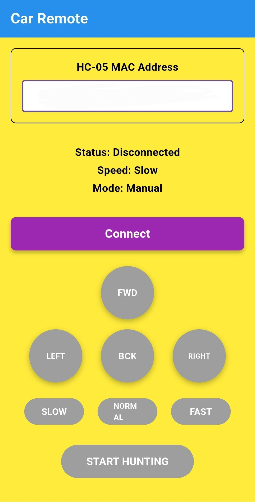

# Flutter Car Remote App

A Flutter mobile app for controlling an Arduino-based robotic car via Bluetooth HC-05 module.

## 📱 Features

- **Direct MAC Address Connection** - Connect to HC-05 using MAC address
- **Real-time Control** - Forward, backward, left, right movement controls
- **Variable Speed** - Slow, normal, and fast speed settings
- **Hunting Mode** - Activates line-tracking functionality on Arduino
- **Controller-style Interface** - Hold buttons to move, release to stop

## 🤖 Hardware Requirements

- Arduino Uno with motor driver
- HC-05 Bluetooth module
- Robotic car chassis with motors
- Line sensors (for hunting mode)
- Android device with Bluetooth

## 📱 App Screenshots



## 🔧 Installation

### Prerequisites
- Flutter SDK installed
- Android Studio or VS Code
- Android device with Bluetooth

### Setup
1. **Clone the repository:**
   ```bash
   git clone https://github.com/YOUR_USERNAME/flutter-car-remote-app.git
   cd flutter-car-remote-app
   ```

2. **Install dependencies:**
   ```bash
   flutter pub get
   ```

3. **Run the app:**
   ```bash
   flutter run
   ```

## 🚗 Usage

1. **Enter MAC Address** - Input your HC-05 module's MAC address (format: XX:XX:XX:XX:XX:XX)
2. **Connect** - Tap the Connect button to establish Bluetooth connection
3. **Control Car** - Use movement buttons to control the car:
   - **Hold** buttons to move
   - **Release** buttons to stop
4. **Adjust Speed** - Tap SLOW/NORMAL/FAST to change speed
5. **Hunting Mode** - Tap START HUNTING to activate line-following mode

## 🔌 Arduino Integration

The app sends these commands to your Arduino:

| Command | Function |
|---------|----------|
| `F` | Move Forward |
| `B` | Move Backward |
| `L` | Turn Left |
| `R` | Turn Right |
| `S` | Stop |
| `X` | Set Slow Speed |
| `Y` | Set Normal Speed |
| `Z` | Set Fast Speed |
| `T` | Start Hunting/Line Tracking |

## 🛠️ Technical Details

- **Framework**: Flutter
- **Bluetooth Library**: flutter_blue_plus
- **Target Platform**: Android
- **Minimum SDK**: API 21 (Android 5.0)
- **Permissions**: Bluetooth, Location

## 📁 Project Structure

```
lib/
├── main.dart          # Main app entry point and UI
android/
├── app/
│   └── src/main/
│       └── AndroidManifest.xml  # Android permissions
pubspec.yaml           # Dependencies and app config
```

## 🐛 Troubleshooting

### Connection Issues
- Ensure HC-05 is powered on and not connected to other devices
- Verify MAC address is correct
- Check Bluetooth permissions are granted
- Make sure Bluetooth is enabled on your device

### Control Issues
- Ensure car is within Bluetooth range (typically 10 meters)
- Check Arduino code is running and receiving serial data
- Verify motor connections and power supply

## 🤝 Contributing

1. Fork the repository
2. Create a feature branch (`git checkout -b feature/amazing-feature`)
3. Commit your changes (`git commit -m 'Add amazing feature'`)
4. Push to the branch (`git push origin feature/amazing-feature`)
5. Open a Pull Request

## 📄 License

This project is open source and available under the MIT License.

## 🙏 Acknowledgments

- Flutter team for the amazing framework
- flutter_blue_plus contributors for Bluetooth functionality
- Arduino community for hardware inspiration
